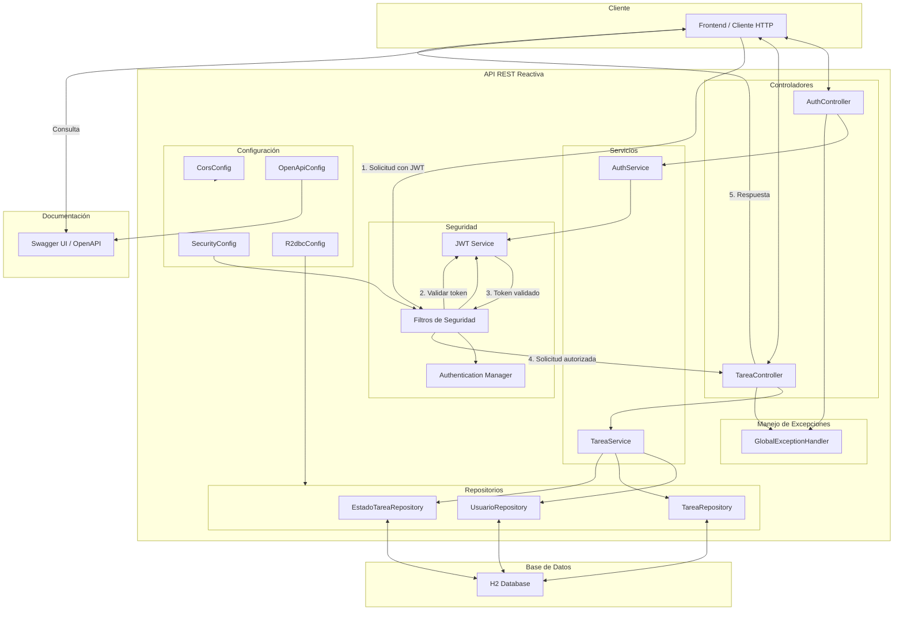
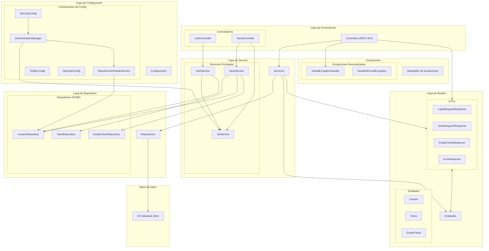

# Gestión de Tareas - NUEVO SPA

Sistema de gestión de tareas desarrollado con Spring Boot WebFlux, JWT y H2.

## Desarrollador
👤 **Junior Pedro Pecho Mendoza**  
💼 **Software Engineer**

## Características

- API RESTful reactiva utilizando Spring WebFlux
- Persistencia reactiva con R2DBC
- Autenticación mediante JWT
- Base de datos H2 en memoria
- Documentación con OpenAPI y Swagger
- Generación de código API-First

## Requisitos

- Java 17
- Maven 3.8+

## Tecnologías utilizadas

- Spring Boot 3.4.x
- Spring WebFlux
- Spring Security
- Spring Data R2DBC
- JWT (JSON Web Token)
- H2 Database
- OpenAPI Generator
- Lombok

## Configuración inicial

1. Clone el repositorio:
   ```
   git clone https://github.com/tu-usuario/ms-spa.git
   cd ms-spa
   ```

2. Compile el proyecto:
   ```
   mvn clean install
   ```

3. Ejecute la aplicación:
   ```
   mvn spring-boot:run
   ```

4. Acceda a Swagger UI:
   ```
   http://localhost:8080/swagger-ui.html
   ```

5. Acceda a Actuator:
   ```
   http://localhost:8080/actuator/health
   ```

6. Acceda a la consola H2:
   ```
   http://localhost:8080/h2-console
   ```
   Datos de conexión:
    - JDBC URL: jdbc:h2:mem:tareas_db
    - Usuario: sa
    - Contraseña: password

## Estructura del proyecto

```
src/main/java/com/spa/
├── api/               # Endpoints generados por el openApi
├── config/            # Configuraciones (Security, R2DBC, etc.)
├── controller/        # Controladores REST
├── model/             
│   ├── dto/           # Data Transfer Objects (Modelos API), generados por el openApi
│   └── entity/        # Entidades de dominio
├── repository/        # Repositorios reactivos
├── security/          # Componentes de seguridad y JWT
├── service/           # Servicios de negocio
└── MsSpaApplication.java  # Clase principal
```

## API Endpoints

### Autenticación
- `POST /api/auth/login` - Autenticar usuario

### Tareas
- `GET /api/tareas` - Listar todas las tareas del usuario
- `GET /api/tareas/{id}` - Obtener una tarea específica
- `POST /api/tareas` - Crear una nueva tarea
- `PUT /api/tareas/{id}` - Actualizar una tarea
- `DELETE /api/tareas/{id}` - Eliminar una tarea

### Estados
- `GET /api/estados` - Listar todos los estados posibles

## Usuarios preconfigurados

| Usuario  | Contraseña  | Descripción                 |
|----------|-------------|-----------------------------|
| admin    | admin123    | Usuario administrador       |
| usuario1 | password123 | Usuario estándar            |
| usuario2 | password123 | Usuario estándar adicional  |

## Ejemplo de uso con cURL

1. Autenticación:
```bash
curl -X POST http://localhost:8080/api/auth/login \
  -H "Content-Type: application/json" \
  -d '{"username":"admin","password":"admin123"}'
```

2. Listar tareas:
```bash
curl -X GET http://localhost:8080/api/tareas \
  -H "Authorization: Bearer {token}"
```

3. Crear tarea:
```bash
curl -X POST http://localhost:8080/api/tareas \
  -H "Content-Type: application/json" \
  -H "Authorization: Bearer {token}" \
  -d '{"titulo":"Nueva tarea","descripcion":"Descripción de la tarea","estadoId":1}'
```

## Colección Postman

En el archivo `postman-collection.json` se incluye una colección de Postman para probar todos los endpoints de la API, y en el `postman-environment.json` se encuentran los enviroments. 

## Características adicionales

- **API First**: El proyecto utiliza generación de código a partir de especificaciones OpenAPI.
- **Seguridad**: Todas las operaciones CRUD de tareas requieren autenticación mediante JWT.
- **Implementación reactiva**: Uso de programación reactiva en todas las capas de la aplicación.

## Diagrama de Arquitectura



## Diagrama de Componentes

